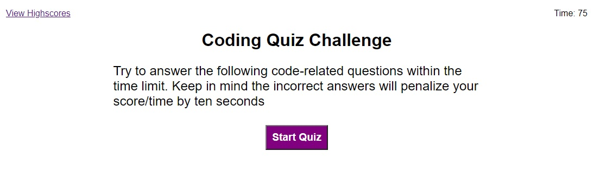
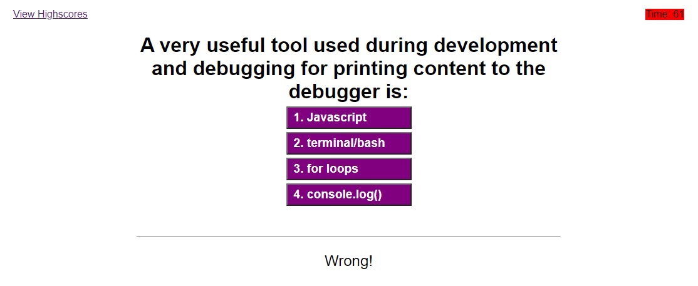

# Code Quiz app

  
[Open website link](https://kzhaanbaev.github.io/code-quiz/)

 

This application can be used to test user's based on their answers
 
We can set all questions with several answers including correct one in an array.
  

 
Based on numbers of questions app will go through each of them and based on user's answers will capture the score.
  

### Followin parts updates based on the answer:
* Timer
* Highscores list
* Answer result (bottom text)
   

  

### High scores are updated based on submissions
* Clear Highscores - will reset database by clearing out all data
* Go Back - will start over the test

  

